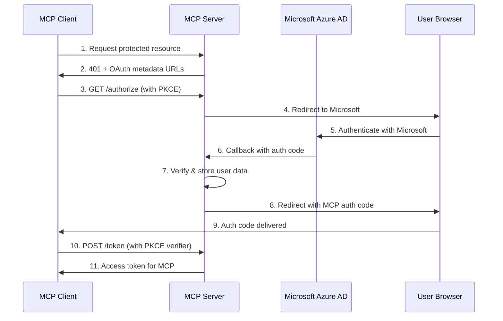

# OAuth Implementation Documentation

This directory contains the authentication implementation for the MCP (Model Context Protocol) server, which uses Microsoft Azure AD as the identity provider and implements a full OAuth 2.1 authorization server.

## Architecture Overview

The MCP server implements a **two-layer OAuth architecture**:

1. **Primary OAuth Layer**: Microsoft Azure AD authentication for user identity
2. **MCP OAuth Server**: Issues tokens for MCP clients after Microsoft authentication



## Security Features

### 1. PKCE (Proof Key for Code Exchange) - MANDATORY
- All authorization requests MUST include:
  - `code_challenge`: Base64url-encoded SHA256 hash of the verifier
  - `code_challenge_method`: Must be `S256`
- Token requests MUST include:
  - `code_verifier`: The original random string (min 43 chars)
- Implementation in `/src/index.ts:generatePKCE()`

### 2. Client Validation
- All OAuth clients must be registered before use
- Validates `client_id` against whitelist
- Validates `redirect_uri` matches registered patterns
- Validates requested scopes are allowed for client
- Implementation in `/src/auth/client-registry.ts`

### 3. Token Encryption
- Microsoft access and refresh tokens encrypted with AES-GCM
- Uses `COOKIE_ENCRYPTION_KEY` environment variable
- Unique IV for each encryption operation
- Implementation in `/src/auth/crypto.ts`

### 4. Session Hijacking Prevention
- Sessions are bound to user IDs: `${userId}:${sessionId}`
- User IDs are SHA256 hashes of email addresses
- Non-deterministic session IDs using `crypto.randomUUID()`
- All session data stored in KV with TTL

### 5. No Token Passthrough
- Microsoft tokens are NEVER passed to MCP clients
- MCP server issues its own tokens after validating Microsoft auth
- Prevents unauthorized access to Microsoft Graph API

### 6. Rate Limiting
- Per-user rate limiting: 100 requests/minute
- Per-IP rate limiting: 1000 requests/minute
- Returns 429 with Retry-After header when exceeded
- Implementation in `/src/auth/rate-limiter.ts`

### 7. Automatic Token Refresh
- Microsoft tokens automatically refreshed before expiration
- 5-minute buffer before expiration
- Refresh tokens rotated on each refresh
- Implementation in `/src/index.ts:getValidMicrosoftToken()`

### 8. Audit Logging
- All auth events logged to D1 database
- Event types: `auth_grant`, `token_refresh`, `tool_call`
- Includes IP addresses, user agents, timestamps

## OAuth Endpoints

### Discovery Endpoints (RFC-compliant)
- `/.well-known/oauth-authorization-server` - Authorization server metadata (RFC 8414)
- `/.well-known/oauth-protected-resource` - Protected resource metadata (RFC 9728)

### OAuth Flow Endpoints
- `/authorize` - Start OAuth flow (redirects to Microsoft)
- `/token` - Exchange authorization code for tokens
- `/oauth/callback/microsoft` - Microsoft OAuth callback
- `/oauth/revoke` - Token revocation (metadata only)
- `/oauth/introspect` - Token introspection (metadata only)

## Implementation Files

### Core OAuth Implementation (`/src/index.ts`)
Contains the main OAuth server implementation:
- `handleOAuthAuthorize()` - Initiates Microsoft OAuth with PKCE
- `handleMicrosoftCallback()` - Processes Microsoft auth response
- `handleOAuthToken()` - Validates PKCE and issues MCP tokens
- `handleAuthorizationServerMetadata()` - RFC 8414 compliance
- `handleProtectedResourceMetadata()` - RFC 9728 compliance

### Provider Configuration (`provider-config.ts`)
Defines OAuth configuration for tool providers:
```typescript
{
  pandadoc: {
    authorizationUrl: "https://app.pandadoc.com/oauth2/authorize",
    tokenUrl: "https://api.pandadoc.com/oauth2/access_token",
    scopes: ["read+write"]
  },
  // ... other providers
}
```

### OAuth Handlers (`oauth-handlers.ts`)
Manages per-tool OAuth flows:
- `handleOAuthAuthorize()` - Redirects to provider OAuth
- `handleOAuthCallback()` - Exchanges codes for provider tokens
- Stores provider tokens in D1 database

### Token Management (`token-manager.ts`)
Handles token storage and refresh:
- Stores tokens encrypted in D1 database
- Automatic token refresh before expiration
- Per-provider token isolation

### OAuth Wrapper (`withOAuth.ts`)
Higher-order function for tools requiring authentication:
```typescript
withOAuth("pandadoc", async ({ args, accessToken }) => {
  // Tool implementation with guaranteed valid token
})
```

## Data Storage

### KV Storage (Temporary)
- OAuth state: `oauth_state:${stateKey}` (10 min TTL)
- PKCE data: `pkce:${stateKey}` (10 min TTL)
- User data: `user:${userId}` (24 hour TTL)
- Auth codes: `auth_code:${code}` (10 min TTL)
- Access tokens: `access_token:${token}` (1 hour TTL)
- Refresh tokens: `refresh_token:${token}` (30 days TTL)
- Rate limits: `ratelimit:${userId}:${minute}` (1 min TTL)

### D1 Database (Persistent)
- `user_sessions` - Long-term user sessions
- `tool_credentials` - Per-user, per-provider tokens
- `audit_logs` - Security and compliance logging

## Environment Variables

### Microsoft OAuth (Primary Auth)
- `MICROSOFT_CLIENT_ID` - Azure AD application ID
- `MICROSOFT_CLIENT_SECRET` - Azure AD client secret
- `MICROSOFT_TENANT_ID` - Azure AD tenant ID

### Security Configuration
- `COOKIE_ENCRYPTION_KEY` - 256-bit hex key for token encryption
- `OAUTH_REGISTERED_CLIENTS` - JSON array of registered OAuth clients (optional)

### Tool Provider OAuth
- `PANDADOC_CLIENT_ID` / `PANDADOC_CLIENT_SECRET`
- `HUBSPOT_CLIENT_ID` / `HUBSPOT_CLIENT_SECRET`
- `XERO_CLIENT_ID` / `XERO_CLIENT_SECRET`
- `NETSUITE_CLIENT_ID` / `NETSUITE_CLIENT_SECRET`
- `AUTOTASK_CLIENT_ID` / `AUTOTASK_CLIENT_SECRET`

## Testing with MCP Inspector

1. Start the dev server:
   ```bash
   pnpm dev
   ```

2. Test OAuth discovery:
   ```bash
   curl http://localhost:8788/.well-known/oauth-authorization-server
   curl http://localhost:8788/.well-known/oauth-protected-resource
   ```

3. Test with MCP Inspector:
   ```bash
   npx @modelcontextprotocol/inspector \\
     --url http://localhost:8788/mcp \\
     --transport http
   ```

4. The inspector will:
   - Detect OAuth is required (401 response)
   - Discover OAuth endpoints
   - Open browser for Microsoft authentication
   - Complete OAuth flow with PKCE

## Security Best Practices Implemented

1. **No Client Secrets in Browser** - Public clients use PKCE
2. **State Parameter** - Prevents CSRF attacks
3. **Nonce in State** - Additional entropy
4. **Short-lived Codes** - 10 minute expiration
5. **One-time Use Codes** - Deleted after exchange
6. **Secure Token Storage** - KV with TTL
7. **User Context Binding** - All tokens bound to user ID
8. **Audit Trail** - All auth events logged
9. **CORS Support** - Proper preflight handling
10. **RFC Compliance** - OAuth 2.1, RFC 8414, RFC 9728

## Common Issues

### "PKCE required" Error
Ensure your OAuth client includes:
- `code_challenge` parameter (base64url-encoded SHA256)
- `code_challenge_method=S256` parameter

### "Invalid code verifier" Error
The `code_verifier` in token request must:
- Match the `code_challenge` from authorization
- Be at least 43 characters long
- Be the original random string (not hashed)

### CORS Errors
All OAuth endpoints support CORS with:
- `Access-Control-Allow-Origin: *`
- Proper OPTIONS preflight handling
- Required headers allowed

## Future Enhancements

1. **JWT Tokens** - Currently using opaque tokens
2. **Token Introspection** - Endpoint defined but not implemented
3. **Token Revocation** - Endpoint defined but not implemented
4. **Client Registration** - Dynamic client registration support
5. **Refresh Token Rotation** - Additional security for refresh tokens